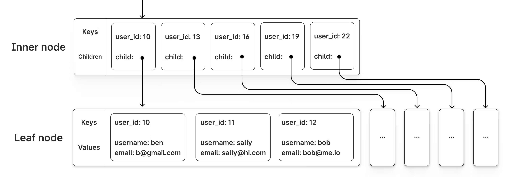

# Database Indexes: What They Are and How They Work

A TecoTalk for the Hero Tech Course 2025.

## Summary

Indexes speed up queries in large datasets by helping databases avoid full table scans. Instead of checking every row one by one, the database uses a fast, tree-based structure (usually a B-Tree) to find what it needs in just a few steps. This makes read operations much faster, though it slightly slows down writes and takes up extra space. In this session, we’ll simulate and observe these trade-offs using Kotlin code.

---

## What are Database Indexes?

A database index is a special data structure that improves the speed of data retrieval operations on a database table. Think of it like the index at the back of a book. Instead of reading the entire book page by page to find a topic (a "**full table scan**"), you can look it up in the index and go directly to the correct page.

The main purpose of an index is to make your `SELECT` queries with `WHERE` clauses significantly faster.

---

## How do Database Indexes Work?

The performance difference comes from how the database finds your data.

* **Without an Index (Full Table Scan 🐢):** The database has no information about where a specific piece of data lives. It must start at the first row, check it, move to the second row, check it, and so on, until it has examined every single row in the table. For large tables, this is very slow.

* **With an Index (Index Seek 🚀):** When you create an index on a column (e.g., `email`), the database builds a separate, sorted data structure called a **B-Tree**. This structure stores the indexed column's values and a direct pointer to the original data row. When you search for a user by email, the database can now navigate this sorted tree to find the exact location of the data in just a few steps, avoiding a full scan.

This efficiency comes with a trade-off:
* **Faster Reads:** Queries that filter on indexed columns are dramatically faster.
* **Slower Writes:** `INSERT`, `UPDATE`, and `DELETE` operations become slightly slower because the database must update both the table and the index structure.
* **More Storage:** The index itself takes up extra disk space.

---

## A Deeper Look: The B-Tree & Time Complexity

The magic of an index lies in its **B-Tree** structure and the dramatic impact it has on search time complexity.

To see this in action, experiment with the interactive B-Tree visualization on [PlanetScale's blog](https://planetscale.com/blog/btrees-and-database-indexes).

After creating a tree, compare the number of steps it takes to find a specific value using two different methods:
- Linear Scan: Checking every value one-by-one in the order they have been inserted.
- Tree Traversal: Following the branches from the root node down to the target value.

A B-Tree is a self-balancing tree data structure that keeps data sorted and is optimized for systems that read and write large blocks of data, like a database. When used for a database index it has a few key components:
* **Root Node:** The single entry point at the very top of the tree.
* **Internal Nodes:** These are like signposts. They don't hold the final data but contain key ranges that guide the search down to the correct branch.
* **Leaf Nodes:** The bottom level of the tree. The leaves contain the sorted index values (e.g., `user500@example.com`) and a pointer to the full data row on disk. A crucial feature is that all leaf nodes are at the same depth.

This structure changes the efficiency of a search:
* **Full Table Scan (No Index):** The time it takes to find an item is directly proportional to the number of rows ($N$) in the table. This is a linear time complexity of **$O(N)$**. To find 1 row in 1 million, you may have to do 1 million checks in the worst case.
* **Index Seek (B-Tree):** By jumping from the root to internal nodes to a leaf, the search eliminates huge portions of the data at each step. This results in a logarithmic time complexity of **$O(\log N)$**. For 1 million rows, an $O(\log N)$ search might only take 20 steps. This is why the indexed search in our simulation is a lot faster.

The B-Tree for our example program will look similar to this diagram:

[*Image source*](https://planetscale.com/blog/btrees-and-database-indexes)

---

## Warnings, Edge Cases, and Common Mistakes

- Index misuse: Adding indexes on every column slows down write performance and bloats storage. Only index columns you filter or join on frequently. 
- Write-heavy workloads: In systems with frequent updates or inserts, too many indexes can cause significant performance issues. 
- Wrong data type: If you use an index on a calculated or transformed field (e.g., LOWER(email)), the database may ignore the index unless you create a specific function-based index. 
- Partial matches: Indexes on a single column help with exact matches, but not always with partial text searches unless the DB supports it (e.g., LIKE 'abc%' can use an index, but LIKE '%abc' usually cannot).

---

## Simulation

### How To

1.  Clone this repo.

2.  Increase values in lines 20 and 21 in `Main.kt` by multiples of 10:
    ```kotlin
    val userCount = 1_000                       // <- manipulate for simulation: first to 10_000, second to 100_000, etc.
    val targetEmail = "user500@example.com"     // <- manipulate for simulation: first to "user5000@example.com", second to "user50000@example.com", etc.
    ```

3.  Run the `main` function.

4.  Report the numbers to the group.

5.  Repeat for all value pairs in below Results Table.

### Code excerpts

The following examples are from the actual simulation code.

Example 1: Search without an index
This query works, but it’s slow for large datasets. The database must scan every row in the Users table until it finds a match.

```
val timeWithoutIndex = measureTimeMillis {
val rs = statement.executeQuery("SELECT * FROM Users WHERE email = '$targetEmail'")
if (rs.next()) {
println("Found user (without index): ${rs.getString("name")}")
}
}
println("Time taken WITHOUT index: $timeWithoutIndex ms")
```

Example 2: Add an index and search again
After creating an index on the email column, the same query becomes much faster. The database can now jump straight to the right row.

```
val indexCreationTime = measureTimeMillis {
statement.execute("CREATE INDEX idx_email ON Users(email)")
}
println("Index created successfully in $indexCreationTime ms.")

// Search again, now using the index
val timeWithIndex = measureTimeMillis {
val rs = statement.executeQuery("SELECT * FROM Users WHERE email = '$targetEmail'")
if (rs.next()) {
println("Found user (with index): ${rs.getString("name")}")
}
}
println("Time taken WITH index: $timeWithIndex ms")
```

You’ll notice a difference in times when you run the simulation with large user counts.

### Results

| Number of Users | Find User | Times without index (in ms) | Times with index (in ms) | Average time without index (in ms) | Average time with index (in ms)   |
| :-------------- | :-------- | :-------------------------- |:-------------------------|:-----------------------------------|:----------------------------------|
| 1,000           | 500       | ...                         | ...                      | ...                                | ...                               |
| 10,000          | 5,000     | ...                         | ...                      | ...                                | ...                               |
| 100,000         | 50,000    | ...                         | ...                      | ...                                | ...                               |
| 1,000,000       | 500,000   | ...                         | ...                      | ...                                | ...                               |
| 10,000,000      | 5,000,000 | ...                         | ...                      | ...                                | ...                               |

---

## Sources
* [Planetscale: B-trees and database indexes](https://planetscale.com/blog/btrees-and-database-indexes)
* [Baeldung: Indexing in Databases (incl. indexing multiple columns)](https://www.baeldung.com/sql/databases-indexing)
* [Stack Overflow: How does database indexing work?](https://stackoverflow.com/questions/1108/how-does-database-indexing-work)
* [Algomaster.io: A Detailed Guide On Database Indexes](https://blog.algomaster.io/p/a-detailed-guide-on-database-indexes)
* [Youtube:  what is a database index?](https://www.youtube.com/watch?v=Jemuod4wKWo)
